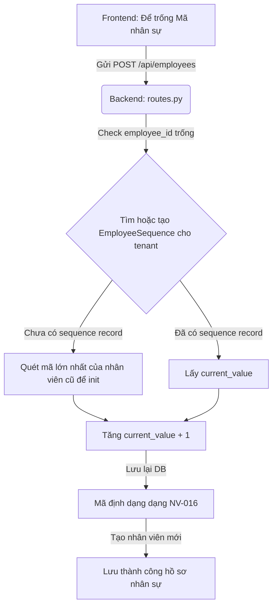

# Cà phê cùng dev: Câu chuyện sinh mã nhân sự (ID) tự động tăng dần mượt mà cho Multi-Tenant

Chào bạn! Hãy lấy một tách trà hoặc cà phê, ngồi xuống đây và chúng ta cùng thảo luận về một bài toán siêu kinh điển nhưng luôn thú vị: **Tự động sinh mã định danh tăng dần (Autoincrement Sequence)**.

Hôm nay, bạn có yêu cầu:
> "Tôi muốn mã nhân sự (ID) được tạo tự động, giá trị tăng dần, ví dụ đang có 15 nhân viên thì nhân viên tiếp theo sẽ có mã là NV-016, NV-017,... bất kể số lượng nhân viên có thay đổi, nhân viên mới tiếp theo sẽ có mã tăng dần."

Nghe qua thì đơn giản đúng không? Chỉ là lấy tổng số nhân viên cộng 1, hoặc lấy mã lớn nhất cộng 1. Nhưng từ góc độ thiết kế hệ thống chuyên nghiệp (Production-grade), có rất nhiều "hố chôn" (pitfalls) ẩn sau yêu cầu tưởng chừng đơn giản này. Hãy cùng mổ xẻ cách chúng ta giải quyết nó một cách cực kỳ mượt mà nhé!

---

## 1. Approach & Reasoning
Khi người dùng bỏ trống trường `employee_id` khi tạo nhân viên, hệ thống sẽ tự động cấp phát một mã tăng dần dạng `NV-016`, `NV-017`,...
Để giải quyết bài toán này, mình đã thiết kế một giải pháp dùng **Sequence Table** chuyên biệt có tên `employee_sequences`.
Ý tưởng cốt lõi:
- Mỗi công ty (Tenant) sử dụng hệ thống sẽ có **một dòng đếm số thứ tự riêng** trong bảng `employee_sequences`, với khóa chính là `tenant_id` và giá trị là `current_value`.
- Khi tạo nhân viên mới:
  1. Chúng ta truy vấn dòng sequence của tenant đó.
  2. Tăng `current_value` lên 1 và lưu lại vào DB.
  3. Định dạng mã này dưới dạng chuỗi `NV-{current_value:03d}` (ví dụ: `NV-016`).
  
**Điểm xuất phát thông minh (Smart Initialization):** 
Nếu hệ thống đã chạy từ trước và có sẵn nhân viên (ví dụ đang có `NV-15` là mã lớn nhất), nhưng bảng sequence chưa tồn tại? Lúc này, script sẽ tự động quét qua tất cả nhân viên hiện tại của tenant đó, tìm ra số thứ tự lớn nhất bằng Regex (ví dụ là `15`), khởi tạo giá trị ban đầu là `15` trong bảng sequence, rồi tiếp tục đếm từ `16` trở đi. Rất mượt mà và không lo đứt gãy dữ liệu cũ!

---

## 2. Roads Not Taken (Những con đường không chọn và tại sao)
Chúng ta có một vài hướng đi khác, nhưng đều bị loại bỏ vì những nhược điểm nghiêm trọng:

### Hướng 1: Dùng hàm `COUNT(*)` của SQL
- **Cách làm**: Lấy tổng số nhân viên hiện tại rồi cộng thêm 1.
- **Tại sao loại bỏ?**: Đây là lỗi sơ đẳng nhất. Nếu bạn có 15 nhân viên, mã tiếp theo là `NV-016`. Tuy nhiên, nếu bạn **xóa đi 1 nhân viên**, số lượng giảm xuống 14. Nhân viên mới thêm vào sau đó sẽ có mã `NV-015`, gây trùng lặp mã định danh hoặc đè lên lịch sử dữ liệu cũ!

### Hướng 2: Dùng `MAX(employee_id)` của SQL
- **Cách làm**: Lấy `employee_id` lớn nhất hiện tại, tách phần số và cộng 1.
- **Tại sao loại bỏ?**: Vẫn bị dính lỗi khi xóa nhân viên. Nếu bạn xóa nhân viên cuối cùng (`NV-015`), mã lớn nhất lúc này là `NV-014`, nhân viên tiếp theo sẽ lại là `NV-015`. Điều này vi phạm yêu cầu của bạn: *"bất kể số lượng nhân viên có thay đổi, nhân viên mới tiếp theo sẽ có mã tăng dần"*.

### Hướng 3: Dùng trường `id` tự tăng (Autoincrement Primary Key) của bảng `employees`
- **Cách làm**: Để database tự cấp phát `id` (ví dụ `23`), rồi cập nhật `employee_id` thành `NV-023` sau khi insert.
- **Tại sao loại bỏ?**: 
  - Khóa chính `id` là tự tăng của cả hệ thống trên mọi tenant, nên nếu tenant A tạo nhân viên (id=1), tenant B tạo (id=2), mã nhân viên của tenant A sẽ là `NV-001`, nhưng của tenant B sẽ nhảy vọt lên `NV-002` thay vì `NV-001` độc lập.
  - Ngoài ra, nếu có lỗi insert hoặc xóa bản ghi cũ, các khoảng trống (gap) trong khóa tự tăng sẽ làm mã nhân sự nhảy số không liên tục (ví dụ đang `NV-015` nhảy vọt lên `NV-023`).

---

## 3. How Things Connect
Sự kết nối giữa các thành phần diễn ra như sau:

Mảnh ghép Frontend `EmployeePage.jsx` cũng được cập nhật tinh tế: sửa placeholder và thêm dòng hướng dẫn nhỏ gọn bên dưới trường Mã nhân sự để người dùng biết họ có thể bỏ trống để hệ thống tự động sinh mã.

---

## 4. Mistakes & Dead Ends (Những hạt sạn nhỏ)
Khi viết regex trích xuất số từ `employee_id` cũ để khởi tạo sequence, cần cực kỳ cẩn thận với trường hợp chuỗi chứa ký tự lạ. Ví dụ mã nhân sự là `NV-015-TEST` hoặc `NV-015`. Nếu chỉ dùng `int(emp.employee_id[3:])`, nó sẽ crash ngay khi gặp chuỗi không thuần số.
Giải pháp là sử dụng Regex `re.sub(r"\D", "", emp.employee_id)` để lọc sạch toàn bộ ký tự không phải là số, chỉ giữ lại số nguyên để parse. Điều này đảm bảo thuật toán cực kỳ trâu bò (robust).

---

## 5. Transferable Lessons
- **Khi làm việc với Multi-tenant, các máy đếm (counters) hay mã chuỗi tự tăng luôn cần được cách ly theo Tenant**. Đừng bao giờ dùng chung một chuỗi đếm toàn cục của hệ thống trừ khi được yêu cầu rõ ràng.
- **Thiết kế Sequence Table** là một pattern kinh điển để sinh số hóa đơn, số phiếu thu, mã nhân viên,... Nó giúp giữ trạng thái đếm ngay cả khi dữ liệu nghiệp vụ bị xóa sạch khỏi bảng chính.

Giờ thì hệ thống tự sinh mã đã hoạt động cực kỳ mượt mà, thông minh và an toàn rồi! Hãy tự tay thêm thử một nhân sự mới và bỏ trống ô "Mã nhân sự" để xem phép màu hoạt động nhé! Chúc bạn một ngày làm việc hiệu quả! ☕
