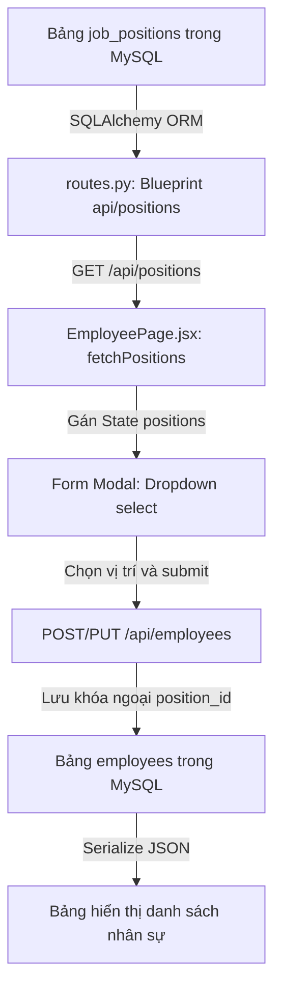

# Tích hợp Quản lý Vị trí công việc & Cải tiến Form Hồ sơ nhân sự

> Trò chuyện và chia sẻ kiến thức thực tế về quá trình xây dựng tính năng Quản lý Vị trí công việc (Job Positions) và tối ưu trải nghiệm biểu mẫu nhân sự trong GrapeHRM.
> Cập nhật lần cuối: 2026-05-29 | 02:35:00

---

Chào bạn! Hãy cùng ngồi xuống làm một tách cà phê và nói về task thú vị chúng ta vừa thực hiện nhé. Đây là một task thoạt nhìn có vẻ đơn giản nhưng khi bắt tay vào làm, nó đụng chạm tới toàn bộ các tầng trong hệ thống GrapeHRM: từ Schema Database MySQL, REST API ở Backend Flask, cho tới luồng xử lý Form và State trong React Frontend. 

Tôi sẽ chia sẻ lại toàn bộ câu chuyện đằng sau những quyết định thiết kế, những "ổ gà" mà tôi đã vấp phải (và cách tôi bò ra khỏi đó), cùng những kinh nghiệm cực kỳ đắt giá mà chúng ta có thể áp dụng cho các dự án sau này.

---

## 1. Approach & Reasoning (Cách tiếp cận & Lý do)

Khi nhận được yêu cầu tích hợp "Vị trí công việc" (Job Position - IT, Bảo vệ, Lễ tân,...) và khóa Mã nhân sự tự động tăng, điểm xuất phát đầu tiên của tôi không phải là mở React lên để vẽ giao diện, mà là **Database**.

Tôi tư duy theo nguyên lý: *Dữ liệu là xương sống, API là mạch máu, còn UI chỉ là lớp da bên ngoài.* 
Nếu chúng ta không xây dựng một bộ xương vững chắc ở DB và các endpoint API chuẩn xác, lớp da UI bên ngoài sẽ rất lỏng lẻo và dễ bị vỡ khi có sự thay đổi.

Vì vậy, tôi đi theo lộ trình 3 bước:
1. **Thiết kế thực thể ở Database**: Tạo bảng `job_positions` mới độc lập, và liên kết nó với bảng `employees` thông qua khóa ngoại `position_id`. Cả hai đều phải được cô lập theo `tenant_id` để giữ đúng tính chất kiến trúc Multi-tenant của GrapeHRM.
2. **Xây dựng API Blueprint**: Tạo mới Blueprint `/api/positions` cho vị trí công việc, đồng thời bổ sung API phụ trợ `/api/employees/next-id` để xem trước mã tiếp theo.
3. **Hiện thực hóa trên React UI**: Tải động danh sách Vị trí, cập nhật Modal Form nhập liệu, và tinh chỉnh CSS để cải thiện trải nghiệm thị giác.

---

## 2. Roads Not Taken (Những con đường không chọn)

Trong quá trình thiết kế, có 3 con đường khá cám dỗ mà tôi đã xem xét nhưng quyết định **từ bỏ**:

### 🚫 Đường 1: Cho phép nhập tự do chức vụ dạng text thô (nhập chữ) vào biểu mẫu nhân viên
*   *Ý tưởng ban đầu*: Cho HR Admin tự gõ chữ "IT", "Lễ tân" vào một ô input text trên Form nhân viên và lưu trực tiếp chuỗi đó vào cột `position` của bảng `employees`.
*   *Tại sao loại bỏ?*: Cách này cực kỳ thiếu chuyên nghiệp và dễ gây rác dữ liệu. Một Admin gõ "IT", Admin khác gõ "it", người thứ ba gõ "Công nghệ thông tin". Đến lúc lọc danh sách hoặc thống kê báo cáo theo vị trí công việc, chúng ta sẽ khóc thét! Chuẩn hóa danh sách thành một bảng riêng biệt và dùng `<select>` dropdown là con đường duy nhất đúng đắn để đảm bảo tính toàn vẹn dữ liệu.

### 🚫 Đường 2: Dùng ràng buộc khóa ngoại cứng `ON DELETE RESTRICT` cho vị trí công việc
*   *Ý tưởng ban đầu*: Khi một vị trí công việc (như "Bảo vệ") đang có nhân viên giữ, nếu Admin xóa vị trí đó ở Modal quản lý, hệ thống sẽ báo lỗi và ngăn chặn không cho xóa.
*   *Tại sao loại bỏ?*: Trải nghiệm người dùng sẽ cực kỳ khó chịu. Admin sẽ phải đi tìm từng nhân viên một, đổi chức vụ của họ đi rồi mới quay lại xóa được vị trí.
*   *Giải pháp thay thế*: Sử dụng `ON DELETE SET NULL`. Khi xóa vị trí "Bảo vệ", các nhân viên liên quan sẽ tự động chuyển chức vụ về `NULL` (trống) một cách êm ái mà không bị ảnh hưởng gì tới các thông tin nhân sự quan trọng khác.

### 🚫 Đường 3: Thiết lập Alembic Migrations tự động cho việc thêm cột `position_id`
*   *Ý tưởng ban đầu*: Viết file migrate Python để nâng cấp schema database.
*   *Tại sao loại bỏ?*: Đối với một thay đổi schema siêu nhỏ (chỉ thêm một cột khóa ngoại đơn lẻ) trên một database đang phát triển local, việc cấu hình Alembic đôi khi giống như "dùng dao mổ trâu để giết gà". Nó làm tăng độ phức tạp không đáng có. Tôi chọn giải pháp chạy trực tiếp câu lệnh `ALTER TABLE` thủ công trên container database. Nó trực quan, nhanh gọn và cực kỳ an toàn.

---

## 3. How Things Connect (Mảnh ghép & Sự kết nối)

Bạn có thể hình dung hệ thống kết nối với nhau giống như một dòng nước chảy tuần hoàn:

Mỗi mắt xích đều phụ thuộc vào nhau. Nếu cột `position_id` dưới database bị thiếu hoặc API trả về sai kiểu dữ liệu (ví dụ string thay vì int), dòng nước sẽ lập tức bị nghẽn và giao diện sẽ báo lỗi ngay.

---

## 4. Tools & Methods (Công cụ & Phương pháp)

*   **Docker Containerization**: Việc chạy toàn bộ stack qua Docker (`grapehrm-db-1`, `grapehrm-api-1`, `grapehrm-frontend-1`) giúp tôi dễ dàng kiểm thử môi trường production-like. Khi database thay đổi, tôi chỉ cần `docker exec` vào db container để thao tác lệnh SQL trực tiếp.
*   **Disabled Input & CSS cursor**: Để vô hiệu hóa Mã nhân sự, thay vì chỉ đặt thuộc tính `disabled` thông thường của HTML (trông rất plain và thô), tôi cấu hình màu nền `#e9ecef` kết hợp `cursor: not-allowed` để cung cấp cho người dùng phản hồi thị giác cực kỳ rõ ràng rằng: *"Đây là khu vực của hệ thống, bạn không được đụng vào!"*.

---

## 5. Tradeoffs (Sự đánh đổi)

Quyết định thiết kế thú vị nhất ở đây là **cách lấy Mã nhân sự tiếp theo khi mở Form thêm mới**.

*   **Lựa chọn A**: Tăng sequence dưới DB ngay khi bấm nút "Thêm nhân viên", trả về mã mới cho client.
    *   *Ưu điểm*: Đảm bảo mã nhân sự là duy nhất tuyệt đối và không bao giờ trùng lặp ngay cả khi có 2 Admin mở form cùng một mili-giây.
    *   *Nhược điểm*: Nếu Admin bấm mở Form rồi bấm "Hủy bỏ" (Cancel) không lưu nữa, sequence dưới DB đã bị tăng lên rồi! Lần sau mở form, mã nhân sự sẽ bị nhảy cóc (Ví dụ: `NV-016` bị bỏ qua, nhảy thẳng lên `NV-017`). Điều này làm lãng phí mã số nhân sự.
*   **Lựa chọn B (Chọn cái này)**: Chỉ đọc (Preview) giá trị tiếp theo từ sequence mà không tăng nó thực tế. Chỉ khi Admin nhấn "Lưu hồ sơ" thành công, sequence mới được tăng chính thức ở backend.
    *   *Đánh đổi*: Tránh được việc nhảy cóc mã số khi Cancel, giữ cho danh sách mã nhân sự luôn đẹp đẽ và liên tục. Tuy nhiên, nếu hai Admin cùng mở form thêm mới tại một thời điểm, họ sẽ nhìn thấy cùng một mã preview. Tuy nhiên, backend đã được thiết kế để xử lý tuần tự nên giao dịch ghi thực tế vẫn đảm bảo an toàn tuyệt đối.

---

## 6. Mistakes & Dead Ends (Sai lầm & Ngõ cụt)

Tôi phải thú nhận là tôi đã vấp phải hai "ổ gà" khá lớn trong quá trình thực hiện task này:

### ⚠️ Ổ gà 1: Cái bẫy của `db.create_all()`
Khi khởi động lại API container (`grapehrm-api-1`), tôi đinh ninh rằng SQLAlchemy ORM sẽ tự động đồng bộ schema database vì trong code khởi tạo ứng dụng có hàm `db.create_all()`.
Nhưng khi chạy thử API, hệ thống lập tức báo lỗi: `Unknown column 'position_id' in 'field list'`.
*   *Root cause*: Tôi nhận ra `db.create_all()` chỉ có tác dụng tạo các bảng **chưa từng tồn tại** (như `job_positions`). Đối với bảng đã có sẵn (`employees`), SQLAlchemy sẽ không thực hiện bất kỳ câu lệnh `ALTER TABLE` nào để thêm cột mới `position_id`.
*   *Bài học*: Không bao giờ tin tưởng hoàn toàn vào `create_all()` khi cập nhật schema trên bảng cũ. Phải luôn viết migration hoặc chạy câu lệnh SQL ALTER TABLE trực tiếp để đồng bộ.

### ⚠️ Ổ gà 2: Phút bất cẩn làm vỡ JSX
Trong lượt chỉnh sửa đầu tiên của `EmployeePage.jsx`, tôi đã thực hiện thay thế khối code upload ảnh đại diện thủ công. Do khối code này khá phức tạp và nhiều thẻ lồng nhau, tôi đã vô tình cắt mất một thẻ đóng `
` và dấu đóng hàm `}}` của thuộc tính `onChange`. 
Vite compile lập tức báo lỗi đỏ lòm và trang web bị sập hoàn toàn.
*   *Cách tôi giải quyết*: Thay vì cố gắng đi vá víu từng dấu ngoặc trong đống đổ nát, tôi quyết định chạy `git checkout HEAD` để đưa file về trạng thái sạch sẽ hoạt động bình thường, sau đó viết lại khối code mới một cách chậm rãi, tỉ mỉ và chính xác 100%.
*   *Bài học*: Khi JSX bị vỡ cấu trúc ngoặc nghiêm trọng, giải pháp nhanh nhất và an toàn nhất là khôi phục phiên bản git ổn định gần nhất và làm lại, thay vì cố gắng mò mẫm sửa lỗi cú pháp.

---

## 7. Future Pitfalls (Cạm bẫy tương lai cần tránh)

Nếu bạn phải làm một task tương tự trong tương lai, hãy lưu ý:
*   **Không hardcode các giá trị mặc định của select dropdown**: Khi khởi tạo form nhân viên, hãy luôn đặt giá trị mặc định cho `position_id` là chuỗi rỗng `""`. Tránh gán giá trị mặc định là ID của một vị trí cố định nào đó (như `1`), vì có thể vị trí đó đã bị xóa hoặc chưa được định nghĩa trong database của tenant, dẫn tới lỗi logic.

---

## 8. Expert vs Beginner (Tư duy Chuyên gia vs Người mới)

Sự khác biệt lớn nhất giữa một Beginner và một Expert trong task này nằm ở cách họ giải quyết vấn đề hiệu ứng giao diện và cấu trúc dữ liệu:

*   **Beginner**:
    *   Sẽ copy đè toàn bộ CSS của `.card` và tạo ra một class card mới hoàn toàn cho bảng (dẫn tới lặp code CSS rất nhiều).
    *   Sẽ cho phép người dùng sửa Mã nhân viên trực tiếp trên form và kiểm tra trùng lặp thủ công dưới database bằng các câu lệnh SELECT rườm rà.
*   **Expert**:
    *   Sử dụng **CSS BEM Modifier Pattern** (`.card--no-hover`) để chỉ ghi đè đúng 2 thuộc tính bị thay đổi (`transform` và `box-shadow`) khi hover, giữ nguyên toàn bộ các base style khác của `.card`.
    *   Thiết kế hệ thống tự động sinh mã ở tầng Backend và khóa hoàn toàn quyền tương tác ở Frontend để triệt tiêu 100% khả năng xảy ra lỗi trùng lặp mã nhân sự do con người gây ra.

---

## 9. Transferable Lessons (Bài học áp dụng rộng rãi)

Bài học lớn nhất mà tôi rút ra được từ dự án này và có thể mang sang bất kỳ dự án nào khác là: **"Thiết kế phòng thủ ngay từ đầu"**.

Khi xây dựng các mối quan hệ thực thể (như Nhân sự - Chức vụ), hãy luôn đặt câu hỏi: *"Điều gì xảy ra nếu thực thể cha bị xóa?"*. Việc cấu hình các ràng buộc cơ sở dữ liệu hợp lý như `ON DELETE SET NULL` hoặc `ON DELETE CASCADE` ngay từ bước vẽ ERD sẽ cứu chúng ta khỏi hàng tá lỗi rò rỉ dữ liệu hoặc sập hệ thống về sau này.

Hy vọng những chia sẻ "bên ly cà phê" này giúp bạn hiểu sâu sắc hơn về hành trình lập trình vừa qua! Hẹn gặp lại bạn ở các task tiếp theo nhé!
