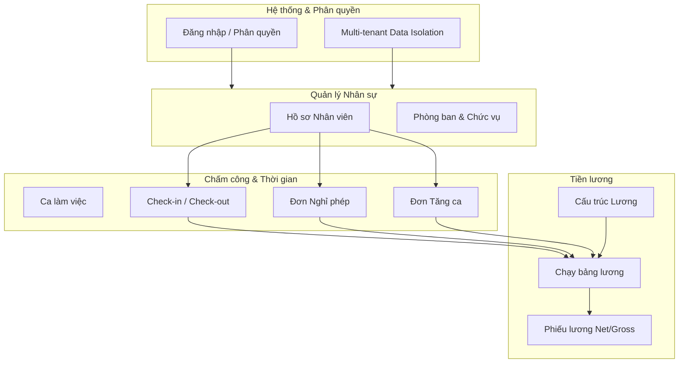

# Tổng quan GrapeHRM

GrapeHRM là hệ thống quản trị nhân sự tổng thể hỗ trợ kiến trúc Multi-tenant (đa khách thuê), cho phép nhiều công ty cùng sử dụng trên một hệ thống mà dữ liệu hoàn toàn độc lập. Dưới đây là các mô-đun (modules) hiện tại và luồng nghiệp vụ (workflows) chính:

## 1. Hệ thống cốt lõi & Phân quyền (Core & Auth)
- **Multi-tenant Architecture:** Mỗi công ty là một `Tenant` riêng biệt. Dữ liệu nhân viên, chấm công, nghỉ phép... đều được cô lập theo `tenant_id`.
- **Role-based Access Control (RBAC):** Phân quyền người dùng theo các vai trò: `super_admin` (quản trị toàn hệ thống), `admin`/`hr_manager` (quản lý nhân sự của 1 tenant), `employee` (nhân viên).
- **Authentication:** Đăng nhập, đăng xuất, tự động gia hạn phiên làm việc (Refresh Token), cập nhật mật khẩu, và thay đổi thông tin cá nhân (Profile).

## 2. Quản lý Hồ sơ Nhân sự (Employee Management)
- Quản lý danh sách nhân viên: Thông tin cá nhân, liên hệ, phòng ban (Department), chức danh (Title).
- Hồ sơ nhân sự lưu trữ thông tin về ngày vào làm (Joined Date), tình trạng hôn nhân, người phụ thuộc (Dependents) - hỗ trợ cho việc tính thuế TNCN sau này.

## 3. Quản lý Chấm công (Time & Attendance)
- **Cấu hình ca làm việc (Work Shifts):** Thiết lập giờ vào/ra, thời gian đi trễ/về sớm cho phép, thời gian nghỉ giữa ca.
- **Điểm danh (Check-in/Check-out):** Nhân viên thực hiện check-in/check-out hàng ngày qua giao diện.
- **Theo dõi & Báo cáo:** Quản lý có thể xem lịch sử điểm danh, số giờ làm việc thực tế, số phút đi trễ/về sớm của nhân viên.

## 4. Quản lý Nghỉ phép (Leave Management)
- **Cấu hình & Số dư:** Định nghĩa các loại phép (Nghỉ ốm, phép năm, nghỉ không lương...) và cấp số dư phép (Leave Balance) cho nhân viên.
- **Workflow nộp & duyệt đơn:**
  1. **Nộp đơn:** Nhân viên tạo đơn xin nghỉ phép (tự động loại trừ ngày cuối tuần T7/CN).
  2. **Hủy đơn:** Nhân viên có thể tự hủy đơn khi đơn vẫn đang ở trạng thái chờ duyệt.
  3. **Phê duyệt:** HR/Admin xem xét duyệt (`APPROVED`) hoặc từ chối (`REJECTED`) đơn xin nghỉ.
  4. **Trừ phép:** Khi đơn được duyệt, hệ thống tự động khấu trừ vào số dư phép của nhân viên.

## 5. Quản lý Tăng ca (Overtime Management)
- **Workflow tăng ca:**
  1. **Đăng ký:** Nhân viên nộp đơn xin làm thêm giờ, chỉ định ngày, số giờ và lý do.
  2. **Quản lý đơn:** Nhân viên có thể hủy (xóa) đơn chưa duyệt.
  3. **Phê duyệt:** HR/Admin duyệt hoặc từ chối đơn tăng ca. Các đơn được duyệt sẽ là căn cứ để tính tiền OT trong bảng lương (với các hệ số cho ngày thường, cuối tuần, ngày lễ).

## 6. Quản lý Tiền lương (Compensation & Payroll)
- **Cấu trúc lương & Phụ cấp/Khấu trừ:** Quản lý mức lương cơ bản của nhân viên, các loại phụ cấp (Allowance) và khấu trừ (Deduction) mặc định.
- **Tính lương (Payroll Run):**
  1. Tạo kỳ lương (tháng/năm).
  2. Hệ thống tổng hợp: Ngày công chuẩn, ngày làm việc thực tế, ngày nghỉ có lương/không lương, số giờ tăng ca.
  3. Tính toán Tổng thu nhập (Gross Salary), các khoản giảm trừ (Bảo hiểm, Thuế TNCN dựa trên người phụ thuộc).
  4. Xuất ra Phiếu lương (Payslip) chi tiết và Lương thực nhận (Net Salary).

---

## Mermaid Flowchart – Tổng quan luồng nghiệp vụ GrapeHRM

### Hướng phát triển tiếp theo (Roadmap)
- Nâng cấp Dashboard tổng quan với các biểu đồ thống kê nhân sự, chi phí lương.
- Xuất/Nhập dữ liệu (Export/Import) nhân viên và bảng lương qua file Excel.
- Tích hợp gửi email thông báo tự động (khi đơn được duyệt, khi có phiếu lương mới).