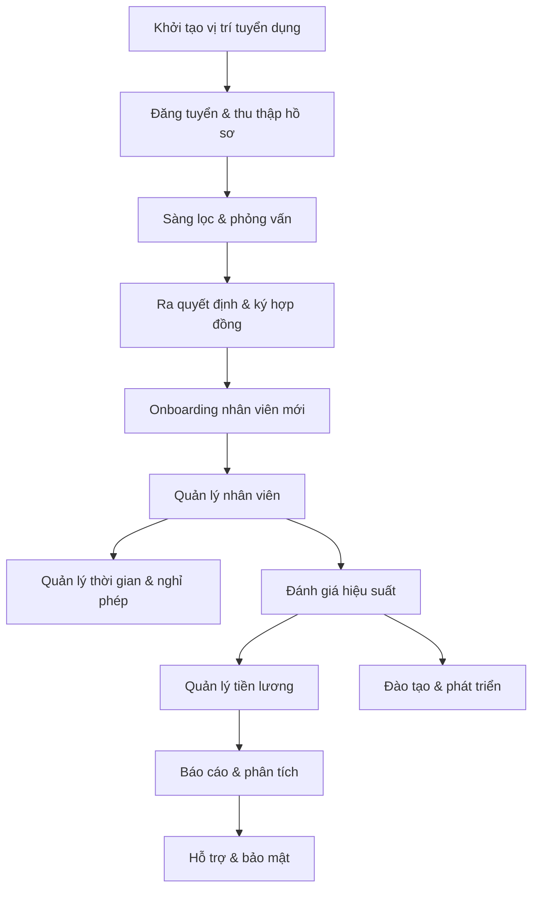

> **Mô tả tổng quan**
> GrapeHRM cung cấp một chuỗi quy trình nhân sự (HR) tích hợp, hỗ trợ từ tuyển dụng đến nghỉ hưu. Dưới đây là workflow chính được tổ chức thành các mô-đun:

## 1. Tuyển dụng (Recruitment)
1. **Tạo vị trí công việc** – Định nghĩa mô tả, yêu cầu và phòng ban.
2. **Đăng tuyển** – Đăng trên cổng việc làm nội bộ/ngoại bộ và portal GrapeHRM.
3. **Thu thập hồ sơ** – Ứng viên nộp CV qua portal.
4. **Sàng lọc** – Sử dụng bộ lọc tự động (điểm số, kỹ năng).
5. **Phỏng vấn** – Lịch biểu, ghi chú, đánh giá.
6. **Ra quyết định** – Cấp đề nghị, gửi thư mời.
7. **Ký hợp đồng** – Tạo hợp đồng trong hệ thống, lưu trữ.

## 2. Onboarding (Đón nhận nhân viên mới)
- Tạo tài khoản người dùng trong GrapeHRM.
- Giao nhiệm vụ, cấp quyền truy cập.
- Thiết lập hồ sơ cá nhân, tài liệu pháp lý.

## 3. Quản lý nhân viên (Employee Management)
- Hồ sơ cá nhân: thông tin cá nhân, hợp đồng, bằng cấp.
- Thay đổi thông tin: chức vụ, phòng ban, mức lương.
- Theo dõi thâm niên, ngày sinh, ngày nghỉ.

## 4. Quản lý thời gian & Nghỉ phép (Time & Leave)
1. **Yêu cầu nghỉ** – Nhân viên nộp đơn nghỉ, chọn loại (annual, sick, maternity…).
2. **Phê duyệt** – Quản lý xem xét, phê duyệt hoặc từ chối.
3. **Cập nhật cân bằng** – Hệ thống tự tính toán ngày còn lại.
4. **Báo cáo** – Tổng hợp ngày nghỉ, xuất file CSV/PDF.

## 5. Đánh giá hiệu suất (Performance Management)
- **Mục tiêu**: Đặt KPI, mục tiêu cá nhân/đội.
- **Đánh giá định kỳ**: Self‑assessment → Manager review → 360° feedback.
- **Kết quả**: Xác định tăng lương, khen thưởng, kế hoạch phát triển.

## 6. Đào tạo & Phát triển (Learning & Development)
- Tạo danh sách phân công.
- Theo dõi tiến độ, hoàn thành.

## 7. Quản lý tiền lương (Compensation)
- Cấu hình bảng lương, phụ cấp, phụ thu.
- Tự động tính lương dựa trên thời gian làm việc, nghỉ phép.
- In/Export bảng lương.

## 8. Thông tin báo cáo (Reporting)
- Báo cáo nhân sự (tổng số nhân viên, tỷ lệ nghỉ).
- Báo cáo tuyển dụng (thời gian tuyển, nguồn ứng viên).
- Báo cáo hiệu suất, chi phí nhân sự.

## 9. Hỗ trợ & Bảo mật (Support & Security)
- Quản lý quyền truy cập (role‑based).

---

## Mermaid Flowchart – Tổng quan quy trình HRM

---

### Lưu ý triển khai
- **Cấu hình ban đầu**: Thiết lập các role (Admin, HR Manager, Supervisor, Employee).
- **Tích hợp**: Kết nối với LDAP/Active Directory nếu cần.
- **Kiểm thử**: Thực hiện test quy trình từ tuyển dụng tới trả lương.
- **Đào tạo người dùng**: Hướng dẫn HR và các manager sử dụng các module.